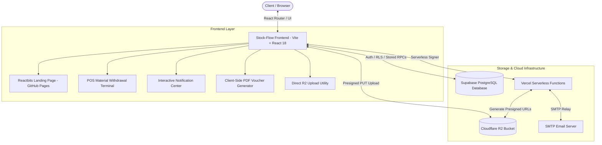

# Stock-Flow — Enterprise Inventory & Material Flow OS


**Stock-Flow** is a production-grade, enterprise inventory and material tracking system developed for **Forth Corporation Public Company Limited** for managing equipment, assets, project allocations, rapid POS material withdrawals, multi-stage approvals, Cloudflare R2 object storage, and real-time audit trails.

🌐 **Live Web Application:** [https://stockflowth.online](https://stockflowth.online)  
✨ **Official Landing Page:** [https://eemeemmeex.github.io/Stock-Flow/](https://eemeemmeex.github.io/Stock-Flow/)

---

## 🚀 Key Modules & Capabilities

### 1. Modern Animated Landing Page (Reactbits UI)
* **High-Tech Aesthetic:** Built with Tailwind CSS v4, Framer Motion, and Reactbits animated components (`Squares`, `SpotlightCard`, `DecryptedText`, `ShinyText`, `Magnet`, `TiltedCard`).
* **Strict SVG Iconography:** 100% vector SVG icons via `lucide-react` with zero unicode emojis for a clean enterprise feel.
* **Automated CI/CD:** Continuous Deployment to GitHub Pages via GitHub Actions (`.github/workflows/deploy-gh-pages.yml`).

### 2. High-Speed Cloudflare R2 Object Storage & Zero Egress
* **Direct Browser-to-R2 Upload:** High-performance direct file uploads via S3 Presigned URLs (`/api/r2-upload-url`), completely offloading media bandwidth from Supabase.
* **Zero Egress Architecture:** Stores item images, avatar profile pictures, and delivery documents in Cloudflare R2 buckets with global CDN caching.
* **Zero Data Loss Migration:** Built-in automated migration pipeline (`npm run migrate:r2`) for converting legacy Base64 records to binary CDN files.

### 3. POS-Style Rapid Material Withdrawal Terminal
* **High-Speed Checkout:** Modern POS cart interface for scanning SKUs, barcodes, and serial numbers.
* **Project Allocation:** Dynamic item assignment mapped directly to active project codes (e.g., DOPA, USO Phase 3).
* **Double-Deduction Prevention:** Database-level 100% Atomic Transactions (`SELECT ... FOR UPDATE` via PostgreSQL RPC) preventing concurrent race conditions.

### 4. Site Installation Kits (BOM) & Real-Time Availability
* **Standard BOM Templates:** Pre-configured Bill of Materials templates for standard site deployments (e.g., Microwave Towers, Base Stations).
* **Instant Readiness Analysis:** Aggregates real-time project stock to calculate exact number of installable site kits and identifies component shortages dynamically.

### 5. Material Checkout & Borrow/Return Lifecycle
* **Equipment Lending Tracking:** Full lifecycle management for borrowed tools and project equipment.
* **Condition Inspection:** Status tracking upon checkout and return.
* **Overdue Alerts:** Automated flagging and alerts for overdue borrowed items.

### 6. Interactive In-App Notification Center
* **Smart Bell Hub (`NotificationBell.jsx`):** Multi-tab filter for *"All"*, *"Unread"*, and *"Action Required"*.
* **One-Click Quick Approval:** Supervisors and Admins can approve withdrawal requests and deduct stock atomically directly from notification cards.
* **Context-Aware Actions:** Instant links to view issued vouchers, inspect returned materials, or audit low-stock items.

### 7. Granular RBAC & Role Management
* **Fine-Grained Permissions:** 12+ modular permission keys (Dashboard, Projects, Items, Stock-In, Withdrawals, Checkouts, History, Reports, Users, Roles, Settings).
* **PermissionRoute Guards:** Protected client-side routing and database Row Level Security (RLS).
* **Email Invitation Engine:** Integrated serverless email invitation service (`/api/send-email`) with branded HTML templates.
* **Self-Service Profile:** User profile management with password change policies and forced reset enforcement.

### 8. Batch Stock-In & Canonical CSV/Excel Validation
* **Batch Import Engine:** Import thousands of inventory records with automatic schema mapping and validation.
* **Serial Number Tracking:** Individual serial registration with duplicate prevention.

### 9. Automated Issue Vouchers & Analytical Reporting
* **Client-Side PDF Generation:** Instant generation of official Material Withdrawal Documents (ใบเบิกพัสดุ) with standard formatting, signatures, and document numbering via `@react-pdf/renderer` & `jspdf`.
* **Visual Analytics:** Interactive Recharts dashboards for stock distribution, movement velocity, and inventory valuation.
* **Data Export:** Multi-format exports to Excel (`.xlsx`) and PDF.

---

## 🛠️ Technology Stack

| Category | Technology | Purpose |
| :--- | :--- | :--- |
| **Core Frontend** | React `18.3` + Vite `5.4` | Ultra-fast Single Page Application (SPA) |
| **Styling & Motion** | Tailwind CSS `4.0` + Framer Motion | Modern utility styles, dark/light themes, spring physics |
| **UI Components** | Radix UI + Reactbits UI | Headless accessible primitives and kinetic interactive components |
| **Iconography** | Lucide React | Strict 100% SVG icon system (Zero Emojis) |
| **Data & Tables** | TanStack Table v8 + Recharts | High-performance virtualized tables and analytical charts |
| **Backend & DB** | Supabase (PostgreSQL 15) | Auth, Row Level Security (RLS), Realtime, and Atomic RPCs |
| **Object Storage** | Cloudflare R2 + AWS S3 SDK | Zero-egress global object storage for images & media |
| **Serverless APIs** | Vercel Serverless Functions | Presigned URL generator (`/api/r2-upload-url`), Email dispatcher (`/api/send-email`) |
| **Document Engine** | `@react-pdf/renderer`, `jspdf`, `xlsx` | In-browser PDF issue voucher and spreadsheet generation |
| **Mobile & PWA** | `vite-plugin-pwa` | Progressive Web App with offline caching & install prompt |

---

## 📐 System Architecture Overview



---

## 💻 Getting Started Locally

### 1. Install Dependencies
```bash
npm install
```

### 2. Start Development Server
```bash
npm run dev
```
The application will be accessible at `http://localhost:5173`.
* View App / Dashboard: `http://localhost:5173/` (or `/login` if unauthenticated)
* View Landing Page: `http://localhost:5173/landing`

### 3. Migrate Legacy Images to Cloudflare R2
```bash
npm run migrate:r2
```

### 4. Build for Production
```bash
npm run build
```

---

## 🔒 Security & Concurrency Design

* **Row-Level Security (RLS):** Every PostgreSQL table enforces RLS based on authenticated user roles and IDs.
* **Atomic Concurrency:** Inventory deduction during POS checkout executes inside atomic PostgreSQL transactions (`SELECT FOR UPDATE`), guaranteeing zero stock discrepancies and zero race conditions under concurrent workloads.
* **Hardened Security Definer Functions:** All PostgreSQL RPCs strictly enforce `SET search_path = public, auth, pg_temp;` to mitigate privilege escalation vulnerabilities (CWE-426) and comply 100% with Supabase Security Linter.
* **Scoped Client-Side Security:** Privileged database operations (e.g. user provisioning, role assignments) are handled via secured RPCs with strict role validations.

---

## 📄 License & Proprietary Notice

Proprietary and Confidential.  
Copyright (c) 2026 **Forth Corporation Public Company Limited**. All rights reserved.  

This software and its documentation are the confidential and proprietary information of Forth Corporation Public Company Limited ("Confidential Information"). Unauthorized copying, distribution, modification, reverse engineering, or public display of this software, via any medium, is strictly prohibited. Refer to the [LICENSE](LICENSE) file for full terms.
