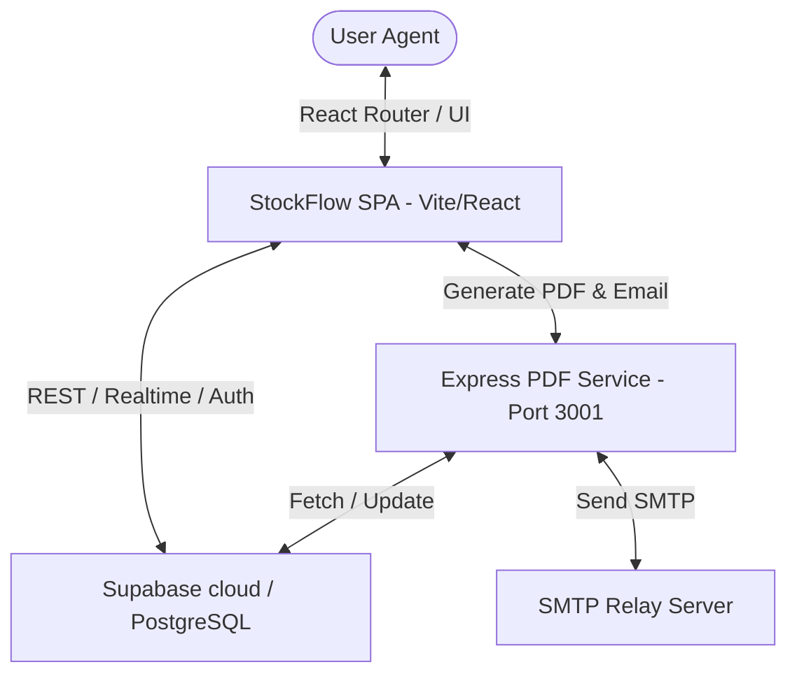

# StockFlow — Enterprise Inventory & Material Management System

StockFlow is a production-grade, modern inventory management web application designed for tracking stock, items, and inventory flow across corporate projects. It is built for **Forth Corporation Public Company Limited** to support complex project-based warehousing, material requests, approval workflows, and live analytical reporting.

---

## 🚀 Key Features

### 1. Project-Based Inventory Flow
*   **Logical Partitioning:** Stock balance is segmented by Project. Items have specific quantities assigned to active locations/projects.
*   **Terminology:** Aligned with corporate hierarchy. Visual tags identify destination projects (`Project Name` + `Project Code`) rather than ambiguous UUIDs.

### 2. POS Material Withdrawal Terminal
*   **Cart System:** Modern POS interface for scanning and selecting materials for withdrawal requests.
*   **Parent-Child Relationships:** Group materials dynamically. Handles child components associated with parent assets.
*   **Double deduction prevention:** Transaction-safe inventory calculations preventing concurrent race conditions.

### 3. Smart Approval & Shortage Dispatch
*   **Audit Flow:** Requested Items ➔ Admin Review ➔ Stock Allocation ➔ Receipt/Dispatch.
*   **Shortage (Partial) Handling:** If inventory is insufficient, the system flags the shortage, records the deficit (`shortage_quantity`), and permits partial fulfillment via admin authorization.

### 4. Advanced Analytical Reports & History
*   **Live Metrics:** Dynamic dashboard reporting total receiving (Stock In), withdrawals, total balance, and active shortages.
*   **Visual Analytics:** Responsive charts (Recharts) summarizing project distributions and inventory status breakdowns.
*   **Material Withdrawal Document:** Exports beautiful PDF/A standard material withdrawal documents (ใบเบิกของ) and Excel sheets on demand.

### 5. Role-Based Access Control (RBAC)
*   **Roles:** Admin, Supervisor, Operator.
*   **Triggers:** Supabase Database custom security model with automated `handle_new_user` triggers, atomic profile mapping, and row-level security (RLS).

---

## 🛠️ Technology Stack

| Layer | Technology | Version | Purpose |
|---|---|---|---|
| **Frontend** | React | `^18.3.1` | Application UI library |
| | Vite | `^5.4.1` | Build tool & Development server |
| | Tailwind CSS | `^4.0.0` | Styling and visual layout |
| | Recharts | `^2.12.7` | Interactive charts and analytics |
| | Lucide React | `^0.428.0` | Modern, clean iconography |
| **Backend** | Supabase | JS `^2.45.0` | PostgreSQL Database, Auth, & RLS Policies |
| **Microservice** | Node.js / Express | `^4.19.2` | PDF Service & SMTP Mailer Backend (Port 3001) |
| | `@react-pdf/renderer` | `^4.5.1` | Dynamic PDF Template Generator |
| | Nodemailer | `^6.9.13` | Transactional email delivery service |

---

## 📐 System Architecture Overview



### 📂 Directory Structure

```text
├── .agents/                 # AI Assistant customization logs, rules, and plugins
├── docs/                    # Architectural decisions, specifications, and plans
├── public/                  # Static assets (images, company logo, icons)
├── src/                     # React Single Page Application source code
│   ├── components/          # Reusable UI components (reports, history, auth, ui)
│   ├── contexts/            # React AuthContext and Theme providers
│   ├── lib/                 # Core client configuration (supabase client, pdf templates)
│   ├── pages/               # Routing pages (History, Withdrawals, Reports, Items, etc.)
│   └── main.jsx             # React SPA entry point
├── supabase/                # Supabase configuration and database schemas
│   └── migrations/          # Version-controlled database migrations (01 to 38)
├── pdf-service/             # Node.js backend microservice for PDF & Email
└── package.json             # Core dependencies and package workspaces configuration
```

---

## ⚙️ Environment Variables Config

Create a `.env` file in the project root folder. Refer to `.env.example` for details:

```ini
# Public browser configuration
VITE_SUPABASE_URL=your-supabase-project-url
VITE_SUPABASE_ANON_KEY=your-supabase-anonymous-key
VITE_PDF_SERVICE_URL=http://localhost:3001

# Server-only Supabase credential
SUPABASE_SERVICE_ROLE_KEY=your-supabase-service-role-key

# Server-only SMTP configuration for Notifications
SMTP_HOST=your-smtp-host
SMTP_PORT=465
SMTP_SECURE=true
SMTP_USER=your-smtp-username
SMTP_PASS=your-smtp-password
SMTP_SENDER_EMAIL=notification@yourcompany.com
SMTP_SENDER_NAME=StockFlow Notification
```

---

## 💻 Local Development Setup

Follow these steps to run the application and its microservice locally:

### 1. Install Dependencies
Run from the root directory (handles workspace package-lock resolution):
```bash
npm install
```

### 2. Run the PDF & Email Service Backend
The PDF service is located in the `pdf-service` directory. Start it using:
```bash
npm run service:backend
```
*   The backend server runs on `http://localhost:3001`.

### 3. Run the Frontend Development Server
Start Vite development server:
```bash
npm run dev
```
*   The web interface will be available at `http://localhost:5173`.

### 4. Build for Production
To build the static single-page application:
```bash
npm run build
```
The compiled output is saved in the `/dist` directory.

---

## 🔒 Security & Database RLS Policies

*   **Auth State:** Managed securely via Supabase Auth.
*   **Row-Level Security (RLS):** Implemented on all PostgreSQL tables in Supabase (e.g., `profiles`, `withdrawal_orders`, `projects`, `items`). Access is restricted based on JWT roles (Admin, Supervisor, Operator).
*   **Credentials:** Kept out of the frontend. Server-level operations (such as password hashing, profile creation triggers, SMTP mail authentication, and PDF template processing) are isolated in the `pdf-service` backend and database RPCs using `SECURITY DEFINER`.

---

## 📄 License

Proprietary and Confidential.  
Copyright (c) 2026 **Forth Corporation Public Company Limited**. All rights reserved.  
Refer to the [LICENSE](file:///d:/APP/Stock-Flow-app/LICENSE) file in this repository for full terms.
