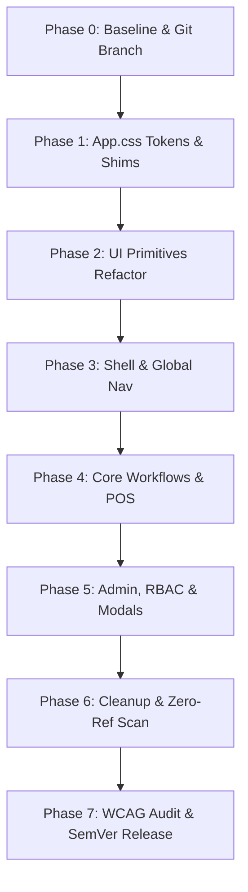

# UI/UX Migration Plan — Enterprise Design System (Stock-Flow Portal)

**สถานะ:** รอ Review และ Approval ก่อนเริ่มดำเนินการ Coding  
**ผู้รับผิดชอบการออกแบบ:** Frontend Architect / Lead UI Engineer  
**ขอบเขตระบบ (Scope):** ระบบการจัดการสต็อกและคลังสินค้า (Stock-Flow Portal) ภายใน workspace `d:\APP\Stock-Flow-app`  

- **รวม:** `src/App.css`, `src/components/ui/*`, `src/components/layout/*`, `src/pages/*`, และ modal/subcomponents ทั้งหมด
- **ไม่รวม (Excluded):** `src/landing/*` (หน้า Landing Page / Marketing Website คงไว้ตามรูปแบบเดิม)
- **ข้อกำหนดความปลอดภัยสูงสุด (Strict Contract):** ห้ามแตะต้องหรือเปลี่ยนแปลง Business Logic, Supabase RPC / Database Schema, R2 Object Storage integration, Route paths, AuthContext/Session, และ RBAC Permission checks ใด ๆ ทั้งสิ้น (แก้เฉพาะ Presentation & Layout Layer)

---

## สารบัญ (Table of Contents)

1. [Current UI/UX Audit & Inventory (ผลการตรวจรหัสปัจจุบัน)](#1-current-uiux-audit--inventory)
2. [Enterprise Design Direction & Principles (หลักการออกแบบใหม่)](#2-enterprise-design-direction--principles)
3. [Design Tokens & Color System (ระบบสีและตัวแปร Tokens)](#3-design-tokens--color-system)
4. [Typography, Radius & Elevation (ฟอนต์ ส่วนโค้ง และเงา)](#4-typography-radius--elevation)
5. [Component Modernization Blueprints (พิมพ์เขียวการปรับปรุง Component)](#5-component-modernization-blueprints)
6. [Zero-Breakage Compatibility Layer (สถาปัตยกรรม Shim รองรับการทยอยอัปเกรด)](#6-zero-breakage-compatibility-layer)
7. [Granular 8-Phase Execution Roadmap (แผนปฏิบัติงาน 8 ขั้นตอน)](#7-granular-8-phase-execution-roadmap)
8. [Responsive Layout & Mobile Ergonomics (การแสดงผลทุกขนาดหน้าจอ)](#8-responsive-layout--mobile-ergonomics)
9. [Accessibility & Performance (WCAG 2.2 AA และประสิทธิภาพ)](#9-accessibility--performance)
10. [Risk Matrix & Mitigation (การประเมินความเสี่ยงและมาตรการป้องกัน)](#10-risk-matrix--mitigation)
11. [Verification & Testing Protocol (ระเบียบการทดสอบและตรวจรับงาน)](#11-verification--testing-protocol)
12. [Definition of Done & Review Gates (เกณฑ์ส่งมอบงาน)](#12-definition-of-done--review-gates)

---

## 1. Current UI/UX Audit & Inventory

### 1.1 สรุปปัญหาของสไตล์เดิม (Legacy Anti-Patterns)

ระบบปัจจุบันใช้สไตล์ลูกผสมระหว่าง **Neumorphism** (`neu-*`) และ **Glassmorphism** (`glass`, `backdrop-blur`) ซึ่งมีจุดบกพร่องต่อระบบงาน Operational/Enterprise ดังนี้:

1. **พื้นหลังสีหม่นและการซ่อนขอบ (Muddy Background & Hidden Borders):**
   - Light Mode กำหนด `--background: 214 26% 90%` (`#e0e5ec`) และ `--border: 214 26% 90%` (กลืนกับพื้นหลัง) ส่งผลให้คอนทราสต์ของข้อความและตารางต่ำมาก
   - Element ต้องพึ่งพา Dual Drop Shadow ขนาด 14px เพื่อแยกขอบเขต ทำให้หน้าจอรกและอ่านข้อมูลงวดสต็อกได้ยาก
2. **การตอบสนองเชิงฟิสิกส์ที่ไม่เหมาะกับงานเร็ว (Toy-like Tactile Press):**
   - มีการใช้ `active:scale-[0.98]` และ `.neu-pressed` (Inset Shadow) บนปุ่มและฟิลด์กรอกข้อมูล ทำให้หน่วงและรู้สึกไม่มั่นคงเมื่อใช้ร่วมกับ Barcode Scanner หรือการคีย์ข้อมูลเร็ว
3. **ปัญหาความโปร่งใสและ Blur (Translucent Glass & Backdrop Blur):**
   - คลาส `.glass` ใช้ `backdrop-filter: blur(12px)` ร่วมกับพื้นหลังโปร่งแสง ทำให้เมื่อวางทับตารางหรือกราฟ คอนทราสต์ของ Modal และ Dropdown จะแกว่งตาม Element ด้านหลัง ส่งผลให้ตกเกณฑ์ WCAG AA
4. **ความโค้งมนที่เทอะทะเกินไป (Excessive Bubble Radii):**
   - มีการใช้ `rounded-2xl` (16px) และ `rounded-3xl` (24px) บนตารางข้อมูล, Input, และการ์ดสรุปยอด ทำให้กินพื้นที่แสดงผล และลด Information Density ของระบบสต็อก
5. **Inline Class Sprawl:**
   - คลาสสไตล์ถูกประกาศซ้ำ ๆ ตามหน้าต่าง ๆ แทนที่จะรวมศูนย์ไว้ที่ Shared UI Primitives (`src/components/ui/*`)

### 1.2 บัญชีไฟล์ที่ต้องปรับปรุง (Audited Source Inventory)

#### ก) ไฟล์ที่พบการใช้งาน `neu-*` (จำนวน 27 ไฟล์)

| เลเยอร์ | รายการไฟล์ | รูปแบบที่พบ |
| --- | --- | --- |
| **Foundation** | `src/App.css` | นิยามคลาส `.neu-flat`, `.neu-flat-sm`, `.neu-pressed`, `.neu-button`, `.neu-primary` |
| **Shared Primitives** | `src/components/ui/button.jsx`<br>`src/components/ui/card.jsx`<br>`src/components/ui/input.jsx`<br>`src/components/ui/table.jsx` | Variants และ Default class มี `neu-*` ฝังอยู่ใน Primitive โดยตรง |
| **Shell & Layout** | `src/components/layout/Sidebar.jsx`<br>`src/components/layout/NotificationBell.jsx` | เมนูนำทาง, Notification Bell |
| **Feature Pages** | `src/pages/Dashboard.jsx`<br>`src/pages/StockIn.jsx`<br>`src/pages/Settings.jsx`<br>`src/pages/UserManagement.jsx`<br>`src/pages/RoleManagement.jsx`<br>`src/pages/Profile.jsx`<br>`src/pages/Manual.jsx` | การ์ดข้อมูล, ส่วนหัวตาราง, แท็บการตั้งค่า |
| **Subcomponents & Modals** | `src/components/dashboard/DashboardStatCard.jsx`<br>`src/components/checkouts/CheckoutPosTerminal.jsx`<br>`src/components/settings/DefaultPasswordManager.jsx`<br>`src/components/settings/EmailTemplateManager.jsx`<br>`src/components/roles/AddRoleModal.jsx`<br>`src/components/roles/EditRoleModal.jsx`<br>`src/components/roles/PermissionManagementModal.jsx`<br>`src/components/users/AddUserModal.jsx`<br>`src/components/users/EditUserModal.jsx`<br>`src/components/users/ResetPasswordModal.jsx`<br>`src/components/users/UserActionModal.jsx`<br>`src/components/users/AvatarUpload.jsx`<br>`src/components/auth/ForceChangePasswordModal.jsx`<br>`src/components/auth/PermissionRoute.jsx` | โมดอลบันทึกข้อมูล, สวิตช์สิทธิ์, ฟอร์มผู้ใช้ |

#### ข) ไฟล์ที่พบการใช้งาน `glass` และ `backdrop-blur` (จำนวน 24 ไฟล์)

| เลเยอร์ | รายการไฟล์ |
| --- | --- |
| **Primitives** | `src/components/ui/dialog.jsx`, `src/components/ui/tooltip.jsx` |
| **Shell & Layout** | `src/components/layout/Sidebar.jsx`, `src/components/layout/Topbar.jsx`, `src/components/layout/NotificationBell.jsx` |
| **Pages** | `src/pages/Dashboard.jsx`, `src/pages/Items.jsx`, `src/pages/StockIn.jsx`, `src/pages/Withdrawals.jsx`, `src/pages/Projects.jsx` |
| **Withdrawal Modals** | `WithdrawalDetailModal.jsx`, `WithdrawalShortageModal.jsx`, `WithdrawalRejectModal.jsx`, `WithdrawalPosTerminal.jsx`, `WithdrawalOrdersList.jsx`, `WithdrawalItemCard.jsx`, `StockLocationBreakdownModal.jsx` |
| **Checkout Modals** | `CheckoutActiveList.jsx`, `CheckoutDetailModal.jsx`, `CheckoutExtendModal.jsx`, `CheckoutHistoryList.jsx`, `CheckoutPosTerminal.jsx`, `CheckoutReturnModal.jsx` |

---

## 2. Enterprise Design Direction & Principles

การปรับโฉมครั้งนี้ยึดหลัก **B2B SaaS Operational Excellence** ที่เน้นความชัดเจน ความเร็วในการอ่านข้อมูล และความสบายตาในการทำงานต่อเนื่องหลายชั่วโมง

```
[Legacy: Neumorphism / Glass]           [Target: Modern Enterprise B2B]
• Background #e0e5ec (สีปูนเปียก)   ──>  • Crisp Slate-50 (#f8fafc) & Pure White (#ffffff)
• เงาคู่ 14px นูนเว้าแบบดินน้ำมัน    ──>  • เส้นขอบคม 1px Solid Border + เงาบางเบา 1-2px
• ขอบมนฟุ้ง 16px - 24px              ──>  • ส่วนโค้งมาตรฐาน 8px - 12px สะอาดตา
• Blur โปร่งแสงอ่านยาก               ──>  • พื้นผิวทึบ 100% Opaque Surface คอนทราสต์คงที่
• ปุ่มเด้งยุบตัว active:scale        ──>  • Micro-interaction เฉพาะสีและเงา มั่นคง ไม่วอกแวก
```

### เสาหลัก 6 ประการ (Six Core Pillars)

1. **Clarity Over Decoration:** พื้นผิวการ์ดทึบแสง (Opaque Surface) 100% เพื่อตัดปัญหาข้อความซ้อนกับพื้นหลัง
2. **Predictable Component States:** ทุก Control มี 5 สถานะที่ชัดเจน: `Default`, `Hover`, `Active`, `Focus-Visible` (2px Ring พร้อม Offset), และ `Disabled` (Opacity 50% พร้อมเคอร์เซอร์ `not-allowed`)
3. **Subtle Elevation & Crisp Boundaries:** ใช้เส้นขอบ 1px `border-border` เป็นเส้นแบ่งหลัก เสริมด้วย Drop Shadow ขนาดบางเบา (`shadow-xs`, `shadow-sm`)
4. **Information Density & Rhythm:** ปรับขนาดระยะห่าง (Padding/Gap) ตามระบบ 4px/8px Grid เพื่อให้ตารางสต็อกและ POS แสดงข้อมูลได้ครบถ้วนโดยไม่ต้องเลื่อนหน้าจอบ่อย
5. **WCAG 2.2 AA Compliance:** คอนทราสต์ของตัวอักษรธรรมดาต้อง ≥ 4.5:1, ตัวอักษรขนาดใหญ่ ≥ 3:1, และองค์ประกอบ UI ที่มีความหมาย (เส้นขอบ Input, ไอคอนบอกสถานะ) ≥ 3:1 ทั้งโหมดสว่างและโหมดมืด
6. **Zero-Breakage Compatibility:** มี Layer ป้องกันหน้าจอพังระหว่างเปลี่ยนผ่าน ทำให้สามารถทยอยอัปเกรดทีละโมดูลได้อย่างปลอดภัย

---

## 3. Design Tokens & Color System

### 3.1 การปรับเปลี่ยนโครงสร้างสี (Palette Transformation)

| Token บทบาท | รหัสเดิม (Light) | รหัสใหม่ (Light Mode) | รหัสใหม่ (Dark Mode) | คำอธิบายการใช้งาน |
| --- | --- | --- | --- | --- |
| `--background` | `214 26% 90%` (#e0e5ec) | `210 20% 98%` (#f8fafc) | `222 27% 10%` (#0b0f17) | พื้นหลังหลักของหน้าเว็บ สะอาด สบายตา |
| `--card` | `214 26% 90%` (#e0e5ec) | `0 0% 100%` (#ffffff) | `222 24% 15%` (#161d2a) | พื้นผิวการ์ด ตาราง และกล่องข้อมูล |
| `--card-foreground` | `222.2 84% 15%` | `222 47% 11%` (#0f172a) | `210 40% 98%` (#f8fafc) | ตัวหนังสือหลักบนการ์ด |
| `--popover` | `214 26% 90%` | `0 0% 100%` (#ffffff) | `222 24% 15%` (#161d2a) | เมนู Dropdown, Tooltip, Dialog |
| `--primary` | `242 82% 64%` | `226 70% 55%` (#3b5bdb) | `226 70% 60%` (#4c6ef5) | สีหลักประจำแบรนด์ (Royal Indigo/Blue) |
| `--primary-foreground` | `210 40% 98%` | `0 0% 100%` (#ffffff) | `0 0% 100%` (#ffffff) | ข้อความบนปุ่ม Primary |
| `--muted` | `214 26% 85%` | `210 40% 96%` (#f1f5f9) | `222 18% 20%` (#1e293b) | พื้นหลังแถบ Header ตาราง, Tag, Badge |
| `--muted-foreground` | `215.4 16.3% 46.9%` | `215 16% 47%` (#64748b) | `215 20% 65%` (#94a3b8) | ข้อความรอง, หน่วยนับ, วันที่ |
| `--border` | `214 26% 90%` (ซ่อนขอบ) | `214 32% 91%` (#e2e8f0) | `222 16% 22%` (#242e3d) | เส้นขอบการ์ดและเส้นคั่นตาราง 1px คมชัด |
| `--input` | `214 26% 90%` | `214 32% 91%` (#e2e8f0) | `222 16% 22%` (#242e3d) | เส้นขอบกล่องข้อความ Input/Select |
| `--ring` | `242 82% 64%` | `226 70% 55%` | `226 70% 60%` | วงแหวน Focus เมื่อกด Tab หรือคลิกฟอร์ม |

### 3.2 Semantic Status Tokens (สีบอกสถานะงานสต็อก)

กำหนดคู่สี Background Tint + Text + Border สำหรับ Badge และ Alert เพื่อไม่ให้พึ่งพาการใช้สีเพียงอย่างเดียว:

- **Success (ผ่าน/พร้อมจ่าย/รับเข้าสำเร็จ):**
  - Light: `bg-emerald-50 text-emerald-700 border-emerald-200`
  - Dark: `dark:bg-emerald-950/40 dark:text-emerald-300 dark:border-emerald-800`
- **Warning (รออนุมัติ/สต็อกใกล้หมด):**
  - Light: `bg-amber-50 text-amber-800 border-amber-200`
  - Dark: `dark:bg-amber-950/40 dark:text-amber-300 dark:border-amber-800`
- **Destructive/Danger (ของหมด/ปฏิเสธ/ยกเลิก):**
  - Light: `bg-red-50 text-red-700 border-red-200`
  - Dark: `dark:bg-red-950/40 dark:text-red-300 dark:border-red-800`
- **Info/Pending (ยืมอยู่/กำลังตรวจสอบ):**
  - Light: `bg-blue-50 text-blue-700 border-blue-200`
  - Dark: `dark:bg-blue-950/40 dark:text-blue-300 dark:border-blue-800`

---

## 4. Typography, Radius & Elevation

### 4.1 Typography Scale

- **Family:** `'Inter', -apple-system, BlinkMacSystemFont, 'Segoe UI', Roboto, sans-serif`
- **Page Title:** `text-2xl font-bold tracking-tight text-foreground` (24px - 28px)
- **Section Heading:** `text-lg font-semibold tracking-tight text-foreground` (18px)
- **Body Text:** `text-sm leading-relaxed text-foreground` (14px)
- **Data & Tables:** `text-sm font-medium tabular-nums` (ตัวเลขตรงหลัก)
- **Microcopy & Metadata:** `text-xs text-muted-foreground` (12px)

### 4.2 Border Radius Scale

เลิกใช้ขนาดใหญ่เกินจำเป็น และจัดระเบียบตามระดับของ Component:

- `--radius-sm: 0.375rem;` (6px) — ใช้กับ Status Badge, Tag, Small Buttons
- `--radius: 0.5rem;` (8px) — ขนาด Default สำหรับ Form Input, Button, Dropdown Menu
- `--radius-md: 0.625rem;` (10px) — องค์ประกอบขนาดกลาง
- `--radius-lg: 0.75rem;` (12px) — Card, Modal Dialog, Slide-over Sheet (ตาม Requirement ส่วนโค้ง 12px)

### 4.3 Elevation & Shadow System (Tailwind CSS v4)

แทนที่เงา Neumorphic นูนหนา 14px ด้วย Modern Drop Shadow:

```css
--shadow-xs: 0 1px 2px 0 rgb(0 0 0 / 0.05);
--shadow-sm: 0 1px 3px 0 rgb(0 0 0 / 0.1), 0 1px 2px -1px rgb(0 0 0 / 0.1);
--shadow-md: 0 4px 6px -1px rgb(0 0 0 / 0.1), 0 2px 4px -2px rgb(0 0 0 / 0.1);
--shadow-lg: 0 10px 15px -3px rgb(0 0 0 / 0.1), 0 4px 6px -4px rgb(0 0 0 / 0.1);
--shadow-xl: 0 20px 25px -5px rgb(0 0 0 / 0.1), 0 8px 10px -6px rgb(0 0 0 / 0.1);
```

- **Static Cards:** ใช้ `border border-border shadow-xs`
- **Interactive Cards / Hover:** ยกตัวระดับ `shadow-sm` พร้อม `hover:border-primary/40`
- **Dropdowns & Popovers:** `shadow-md`
- **Modal Dialogs:** `shadow-xl`

---

## 5. Component Modernization Blueprints

### 5.1 Button (`src/components/ui/button.jsx`)

- **เดิม:** มี `neu-primary`, `neu-button`, `shadow-2xs`, และ `active:scale-[0.98]`
- **ใหม่:** เปลี่ยนเป็น Clean Flat Solid & Outline พร้อม Ring Focus ชัดเจน

```jsx
// Blueprint ใหม่ของ Button Variants
const buttonVariants = cva(
  "inline-flex items-center justify-center whitespace-nowrap rounded-lg text-sm font-medium transition-colors focus-visible:outline-none focus-visible:ring-2 focus-visible:ring-ring focus-visible:ring-offset-2 disabled:pointer-events-none disabled:opacity-50 select-none cursor-pointer",
  {
    variants: {
      variant: {
        default: "bg-primary text-primary-foreground shadow-xs hover:bg-primary/90",
        destructive: "bg-destructive text-destructive-foreground shadow-xs hover:bg-destructive/90",
        outline: "border border-input bg-background shadow-xs hover:bg-accent hover:text-accent-foreground",
        secondary: "bg-secondary text-secondary-foreground shadow-xs hover:bg-secondary/80",
        ghost: "hover:bg-accent hover:text-accent-foreground",
        link: "text-primary underline-offset-4 hover:underline p-0 h-auto font-medium",
        emerald: "bg-emerald-600 text-white shadow-xs hover:bg-emerald-700",
        indigo: "bg-indigo-600 text-white shadow-xs hover:bg-indigo-700",
      },
      size: {
        default: "h-9 px-4 py-2 text-sm gap-2",
        sm: "h-8 px-3 text-xs gap-1.5 rounded-md",
        lg: "h-10 px-6 text-sm gap-2.5 font-semibold",
        icon: "h-9 w-9 p-0",
        "icon-sm": "h-8 w-8 p-0 rounded-md",
      },
    },
    defaultVariants: {
      variant: "default",
      size: "default",
    },
  }
)
```

### 5.2 Card (`src/components/ui/card.jsx`)

- **เดิม:** บังคับใส่ `neu-flat text-card-foreground`
- **ใหม่:** เปลี่ยนเป็น `rounded-xl border border-border bg-card text-card-foreground shadow-xs`

```jsx
// Blueprint ใหม่ของ Card
const Card = React.forwardRef(({ className, ...props }, ref) => (
  <div
    ref={ref}
    className={cn(
      "rounded-xl border border-border bg-card text-card-foreground shadow-xs transition-colors",
      className
    )}
    {...props}
  />
))
```

### 5.3 Input (`src/components/ui/input.jsx`)

- **เดิม:** มี `neu-pressed` (Inset Shadow) และความสูง `h-11` เทอะทะ
- **ใหม่:** ใช้ความสูงมาตรฐาน `h-9` พร้อมเส้นขอบคมชัดและ Focus Ring

```jsx
// Blueprint ใหม่ของ Input
const Input = React.forwardRef(({ className, type, ...props }, ref) => {
  return (
    <input
      type={type}
      className={cn(
        "flex h-9 w-full rounded-lg border border-input bg-background px-3 py-1 text-sm shadow-xs transition-colors file:border-0 file:bg-transparent file:text-sm file:font-medium placeholder:text-muted-foreground focus-visible:outline-none focus-visible:ring-2 focus-visible:ring-ring focus-visible:ring-offset-1 disabled:cursor-not-allowed disabled:opacity-50",
        className
      )}
      ref={ref}
      {...props}
    />
  )
})
```

### 5.4 Table (`src/components/ui/table.jsx`)

- **เดิม:** `TableHeader` มี `neu-flat-sm`, `TableRow` ใช้ `border-none`
- **ใหม่:** `TableHeader` ใช้ `bg-muted/60 border-b border-border text-xs uppercase tracking-wider font-semibold`, `TableRow` ใช้ `border-b border-border/70 hover:bg-muted/50 transition-colors`

### 5.5 Dialog / Modal (`src/components/ui/dialog.jsx`)

- **เดิม:** ฝังคลาส `glass` และ `sm:rounded-lg`
- **ใหม่:** Opaque Solid Background `bg-card border border-border shadow-xl rounded-xl` ไม่เบลอเนื้อหาหลัง Overlay เพื่อให้อ่านข้อมูลง่ายและ Performance สูงสุด

### 5.6 Shell (Sidebar & Topbar)

- **Sidebar (`src/components/layout/Sidebar.jsx`):**
  - ลบคลาส `bg-[var(--glass-card-bg)] backdrop-blur-xl border-[var(--glass-card-border)]`
  - ปรับเป็น `bg-card border-r border-border shadow-xs`
  - ปรับ Active Navigation Link: จาก `neu-pressed` เป็น `bg-primary/10 text-primary font-semibold border-l-2 border-primary`
- **Topbar (`src/components/layout/Topbar.jsx`):**
  - ลบคลาส `backdrop-blur-xl` ปรับเป็น `bg-card/95 border-b border-border shadow-xs`
  - ปรับปุ่มโปรไฟล์และ Theme Toggle จาก `glass-input` เป็น Standard Outline Button

---

## 6. Zero-Breakage Compatibility Layer

เพื่อให้สามารถปรับปรุงระบบที่มีไฟล์เกี่ยวข้องกว่า 50 ไฟล์ได้โดย **หน้าจอไม่พัง (Zero Breakage)** ในช่วงระหว่างทำ Phase 1 ถึง Phase 6 เราจะสร้าง **CSS Compatibility Shims** ใน `src/App.css` ดังนี้:

```css
/* ==========================================================================
   TRANSITIONAL COMPATIBILITY SHIMS (ลบออกทั้งหมดใน Phase 6 เมื่อแปลงครบ)
   ช่วยให้หน้าเดิมที่ยังไม่ได้แก้ไฟล์แสดงผลเป็น Flat Enterprise ทันทีใน Day 1
   ========================================================================== */
@layer utilities {
  /* แปลง Neu-Flat เดิมเป็นการ์ดคลีนสีทึบ */
  .neu-flat {
    background-color: hsl(var(--card)) !important;
    border: 1px solid hsl(var(--border)) !important;
    box-shadow: var(--shadow-xs) !important;
    border-radius: var(--radius-lg);
  }
  .neu-flat-sm {
    background-color: hsl(var(--muted)) !important;
    border: 1px solid hsl(var(--border)) !important;
    box-shadow: none !important;
    border-radius: var(--radius);
  }
  /* แปลง Neu-Button เป็น Enterprise Button */
  .neu-button {
    background-color: hsl(var(--card)) !important;
    border: 1px solid hsl(var(--input)) !important;
    box-shadow: var(--shadow-xs) !important;
    color: hsl(var(--foreground)) !important;
  }
  .neu-button:active {
    box-shadow: none !important;
    background-color: hsl(var(--accent)) !important;
  }
  .neu-primary {
    background-color: hsl(var(--primary)) !important;
    border: 1px solid transparent !important;
    color: hsl(var(--primary-foreground)) !important;
    box-shadow: var(--shadow-xs) !important;
  }
  /* แปลง Inset Shadow เป็น Flat Input */
  .neu-pressed, .neu-pressed-sm {
    background-color: hsl(var(--background)) !important;
    border: 1px solid hsl(var(--input)) !important;
    box-shadow: none !important;
  }
  /* แปลง Glass เป็น Opaque Elevated Surface */
  .glass {
    background-color: hsl(var(--card)) !important;
    border: 1px solid hsl(var(--border)) !important;
    backdrop-filter: none !important;
    -webkit-backdrop-filter: none !important;
    box-shadow: var(--shadow-md) !important;
  }
}
```

**ข้อดีของกลยุทธ์นี้:**

1. ทันทีที่ลง Phase 1 หน้าเว็บทั้งหมดจะเปลี่ยนจากสไตล์ Neumorphism หม่นหมอง กลายเป็นสไตล์ Enterprise สะอาดตาทันทีทั้งระบบ
2. นักพัฒนาสามารถทยอยเปิดไฟล์ทีละหน้าเพื่อเปลี่ยนคลาส inline ให้เป็น Shared Primitives โดยไม่ต้องกังวลว่าหน้าที่ยังไม่ได้แก้อ่านไม่ออก
3. เมื่อแก้ครบทุกไฟล์ จะทำการค้นหาแบบ Grep ให้มั่นใจว่ามี 0 reference ก่อนลบ Shim ชุดนี้ออกใน Phase 6

---

## 7. Granular 8-Phase Execution Roadmap



### Phase 0: Pre-flight Baseline & Safety Setup

- [ ] สร้าง Git Branch ใหม่เฉพาะงานนี้: `git checkout -b feat/enterprise-ui-ux-migration`
- [ ] รันคำสั่งตรวจสอบสุขภาพโปรเจกต์:
  - `npm run build` ตรวจสอบสถานะการ Build ปัจจุบัน
  - บันทึก Screenshots ของหน้าจอหลัก (Dashboard, Items, StockIn, Withdrawals, Checkouts, Settings, Users) ใน Light/Dark Mode เพื่อใช้เป็น Visual Reference
- [ ] สำรองไฟล์ `src/App.css` ไว้ก่อนดำเนินการ

### Phase 1: Token Foundation & Compatibility Shims

- [ ] อัปเดต `src/App.css`:
  - แทนที่ค่าสีเดิม (`#e0e5ec`) ด้วย Clean Palette (`#f8fafc` Light, `#0b0f17` Dark)
  - กำหนดค่า `--border` และ `--input` ให้เป็นเส้น 1px ชัดเจน
  - ปรับค่าความโค้งมน `--radius` เป็น `0.5rem` (8px) และ `--radius-lg` เป็น `0.75rem` (12px)
  - ใส่ Transitional Compatibility Shims สำหรับ `.neu-*` และ `.glass`
- [ ] ตรวจสอบว่าระบบ Compile ผ่านและไม่มีหน้าจอใดแสดงผลผิดเพี้ยนรุนแรง

### Phase 2: Core UI Primitives Modernization

- [ ] `src/components/ui/button.jsx`: ปรับโครงสร้าง Variants, ลบ `neu-primary`, `neu-button`, `active:scale`
- [ ] `src/components/ui/card.jsx`: ปรับโครงสร้าง Card, Header, Content, Footer
- [ ] `src/components/ui/input.jsx`: ปรับโครงสร้าง Input, Focus Ring
- [ ] `src/components/ui/table.jsx`: ปรับ Header Background, Row Borders, Cell Padding
- [ ] `src/components/ui/dialog.jsx`: ปรับ Overlay และ DialogContent ให้เป็น Opaque Card
- [ ] `src/components/ui/tooltip.jsx`: ลบคลาส glass ให้เป็น Solid Popover
- [ ] `src/components/ui/RoleBadge.jsx` & `badgePresets.js`: จัดระเบียบ Semantic Badges

### Phase 3: Application Shell & Global Navigation

- [ ] `src/components/layout/Sidebar.jsx`:
  - ลบคลาส `glass` และ `backdrop-blur-xl` ปรับเป็น Solid Border
  - ปรับแต่งสถานะ Active/Hover ของเมนูนำทาง
  - ปรับแต่ง Mobile Drawer ให้เปิดปิดลื่นไหล
- [ ] `src/components/layout/Topbar.jsx`:
  - ปรับ Header Background และขอบล่าง
  - ปรับ User Profile Dropdown Menu และ Theme Switcher
- [ ] `src/components/layout/NotificationBell.jsx`:
  - ปรับขนาดปุ่มกระดิ่งและ Dropdown Content ให้เป็น Opaque Popover พร้อม Badge ที่ชัดเจน

### Phase 4: Operational Core Pages & Workflows

- [ ] **4.1 Dashboard (`src/pages/Dashboard.jsx` & `DashboardStatCard.jsx`):**
  - ปรับการ์ดสรุป KPI ทั้งหมดให้เป็น Clean Elevation
  - ปรับแต่งกราฟ Recharts: เส้น Grid สบายตา, Tooltip อ่านง่ายใน Light/Dark Mode
- [ ] **4.2 Inventory Items (`src/pages/Items.jsx`):**
  - ปรับแถบตัวกรอง (Search, Category, Warehouse Filter Bar)
  - ปรับแต่ง Data Table: Header ตรึงบน (Sticky Header), Pagination Bar
- [ ] **4.3 Stock In Workflow (`src/pages/StockIn.jsx`):**
  - ปรับฟอร์มนำเข้าสต็อก, Step Wizard, Upload Area
- [ ] **4.4 Withdrawals & POS (`src/pages/Withdrawals.jsx` & Modals):**
  - ปรับปรุง `WithdrawalPosTerminal.jsx`
  - ปรับปรุง `WithdrawalDetailModal.jsx`, `WithdrawalShortageModal.jsx`, `WithdrawalRejectModal.jsx`
- [ ] **4.5 Checkouts & POS (`src/pages/Checkouts.jsx` & Modals):**
  - ปรับปรุง `CheckoutPosTerminal.jsx`
  - ปรับปรุง `CheckoutActiveList.jsx`, `CheckoutHistoryList.jsx`, `CheckoutReturnModal.jsx`, `CheckoutExtendModal.jsx`
- [ ] **4.6 History & Reports (`src/pages/History.jsx`, `src/pages/Reports.jsx`):**
  - ปรับปรุง Datepicker Controls, Export Buttons, Report Preview Cards

### Phase 5: Administration, Management & Auth

- [ ] **5.1 System Settings (`src/pages/Settings.jsx`):**
  - ปรับปรุง Tabs Navigation
  - ปรับปรุง `EmailTemplateManager.jsx` และ `DefaultPasswordManager.jsx`
- [ ] **5.2 User & Role Management (`UserManagement.jsx`, `RoleManagement.jsx`):**
  - ปรับปรุง Modals: `AddUserModal`, `EditUserModal`, `ResetPasswordModal`, `UserActionModal`, `AvatarUpload`
  - ปรับปรุง Modals: `AddRoleModal`, `EditRoleModal`, `PermissionManagementModal`
- [ ] **5.3 Profile & Authentication (`Profile.jsx`, `auth/*`):**
  - ปรับปรุง `ForceChangePasswordModal.jsx`, `PermissionRoute.jsx`
- [ ] **5.4 Manual & Projects (`Manual.jsx`, `Projects.jsx`):**
  - ปรับปรุง Documentation Cards และ Project Kanban/List Views

### Phase 6: Deprecation & Legacy Cleanup

- [ ] รันการค้นหาอย่างละเอียด (Grep Search):
  - ตรวจสอบ `neu-` ใน `src/` (เป้าหมาย: 0 matches นอกเหนือจากเอกสาร)
  - ตรวจสอบ `glass` ใน `src/` (เป้าหมาย: 0 matches นอกเหนือจากเอกสาร)
  - ตรวจสอบ `backdrop-blur` ใน `src/` (อนุญาตเฉพาะ Mobile Drawer Backdrop)
- [ ] ลบ Compatibility Shims ออกจาก `src/App.css`
- [ ] รัน `npm run build` และตรวจสอบ Bundle Size

### Phase 7: Verification, Accessibility & SemVer Release

- [ ] ตรวจสอบเกณฑ์ WCAG 2.2 AA Contrast ครบทุกจุด
- [ ] ตรวจสอบ Responsive ที่ขนาดหน้าจอ: 320px, 375px, 768px, 1024px, 1440px
- [ ] ทดสอบ Keyboard Navigation (Tab, Enter, Space, Escape)
- [ ] ตรวจสอบความถูกต้องของ Flow ธุรกรรมสต็อก (Stock In, Withdrawal, Checkout)
- [ ] ปรับหมายเลขเวอร์ชันตามข้อกำหนด Mandatory System Version Management (SemVer MINOR / PATCH)

---

## 8. Responsive Layout & Mobile Ergonomics

ระบบคลังสินค้ามีการใช้งานผ่านแท็บเล็ตและสมาร์ทโฟนของเจ้าหน้าที่ตรวจนับสต็อกหน้างาน จึงกำหนดเกณฑ์ Responsive ดังนี้:

1. **Touch Targets:** ปุ่มกด, ไอคอนแอ็กชัน, และ Checkbox ทั้งหมดต้องมี Touch Target ไม่ต่ำกว่า `44x44px` บนหน้าจอมือถือ
2. **Horizontal Table Scroll:** ตารางสต็อกบนจอเล็กกว่า 768px ต้องมี Container `overflow-x-auto` พร้อมขอบเขตที่เห็นชัดเจน ไม่ให้เกิดการดัน Layout หลุดจอ
3. **Modal Dialogs on Mobile:** บนหน้าจอต่ำกว่า 640px Modal ต้องปรับเป็น Bottom Sheet หรือ Full-screen Dialog พร้อมปุ่มปิดที่เข้าถึงง่ายด้วยนิ้วโป้ง
4. **Information Hierarchy at 320px - 375px:** เมื่อหน้าจอแคบมาก ปุ่มคำสั่งคู่ (Confirm / Cancel) ให้จัดเรียงแบบ Stacked (ปุ่มยืนยันอยู่บน ปุ่มยกเลิกอยู่ล่าง เต็มความกว้าง 100%)

---

## 9. Accessibility (WCAG 2.2 AA) & Performance

### 9.1 Accessibility Checklist

- [ ] **Color Contrast:** ข้อความทั้งหมดมี Contrast Ratio อย่างน้อย 4.5:1 (โหมดสว่าง: `#0f172a` บน `#ffffff` = 15.4:1, โหมดมืด: `#f8fafc` บน `#161d2a` = 14.1:1)
- [ ] **Focus Visible:** ทุก Element ที่โต้ตอบได้มี `focus-visible:ring-2 focus-visible:ring-primary focus-visible:ring-offset-2` ชัดเจน
- [ ] **Form Validation:** ฟิลด์ที่มี Error ต้องมี `aria-invalid="true"`, ข้อความแจ้งเตือนระบุ `id` และเชื่อมโยงผ่าน `aria-describedby`
- [ ] **Non-Color Status:** สถานะการเบิกจ่ายต้องมีทั้งข้อความและไอคอนประกอบเสมอ (เช่น ไอคอนติ๊กถูกคู่กับคำว่า "อนุมัติแล้ว")

### 9.2 Rendering Performance

- การนำ `backdrop-filter: blur(12px)` ออกจาก Sidebar, Topbar, และ Modals ช่วยลด GPU Composite Overdraw ส่งผลให้ Frame Rate ในการเลื่อนตารางสต็อกพันรายการคงที่ที่ 60 FPS บนอุปกรณ์เคลื่อนที่

---

## 10. Risk Matrix & Mitigation

| ความเสี่ยง (Risk) | ระดับผลกระทบ | โอกาสเกิด | มาตรการป้องกัน (Mitigation) | แผนรับมือฉุกเฉิน (Rollback) |
| --- | --- | --- | --- | --- |
| **ลบคลาสเดิมแล้วหน้าจอพัง** | สูง | กลาง | ใช้ Compatibility Shims ใน Phase 1 ทำให้รองรับคลาสเก่าได้ตลอดเวลา | ถอยกลับไปยัง commit ก่อนหน้าของ phase นั้น |
| **คอนทราสต์ใน Dark Mode เพี้ยน** | ปานกลาง | กลาง | ตรวจสอบ Token Pair ใน `App.css` อย่างละเอียด และแคปเจอร์ภาพทุก Phase | ปรับแก้เฉพาะค่าตัวแปร HSL ใน `App.css` |
| **ขนาดกล่องข้อความดันตารางล้น** | ปานกลาง | ต่ำ | คุมความสูง Input ที่ `h-9` และ Cell Padding ที่ `px-3 py-2` | ปรับ Utility ใน `table.jsx` |
| **แตะต้องโดน Logic / API** | วิกฤต | ต่ำมาก | จำกัด Diff ใน Git ให้มีเฉพาะ JSX Markup, CSS Classes, และ Primitives ห้ามแก้ State/Hooks/RPC | Revert Commit ทันที |

---

## 11. Verification & Testing Protocol

ทุกขั้นตอนต้องผ่านการตรวจสอบตามเกณฑ์ 4 ด้าน:

1. **Automated Code Checks:**

   ```bash
   npm run build   # ต้องผ่าน ไม่มีข้อผิดพลาด
   npm run lint    # ต้องไม่มี lint errors ใหม่
   ```

2. **Visual & Theme Checks:**
   - ตรวจสอบหน้าจอครบทั้ง 100% Light Mode และ Dark Mode
   - ทดสอบการกดสลับธีม (Theme Toggle) ว่าไม่มีการกระพริบหรือสีตกค้าง
3. **Viewport Matrix:**
   - Mobile: 320px, 375px (iPhone SE, Android)
   - Tablet: 768px (iPad Portrait)
   - Laptop / Desktop: 1024px, 1440px
4. **Operational Smoke Tests (ทดสอบการใช้งานจริง):**
   - การเปิดหน้า Stock-In และจำลองเลือกสินค้า
   - การเปิดหน้า Withdrawals POS Terminal และจำลองสแกนรายการ
   - การเปิด-ปิด Modal ต่าง ๆ และทดสอบการกดปุ่ม `Escape`

---

## 12. Definition of Done & Review Gates

### 12.1 เกณฑ์ส่งมอบงาน (Acceptance Criteria)

- [ ] คลาส `neu-*`, `glass`, และ `backdrop-blur` (ที่ไม่ใช่ Backdrop Overlay) ถูกแทนที่ด้วย Enterprise Tokens ครบ 100%
- [ ] ไฟล์ใน `src/components/ui/*` กลายเป็น Single Source of Truth สำหรับ Button, Card, Input, Table, Dialog, Badge
- [ ] ไม่มีการเปลี่ยนแปลงพฤติกรรมของ API, RPC, Routing, State หรือ Database แม้แต่จุดเดียว
- [ ] ผ่านการตรวจสอบ Contrast WCAG 2.2 AA ทั้ง Light Mode และ Dark Mode
- [ ] ค้นหา Grep ในโฟลเดอร์ `src/` ไม่พบคลาส `neu-` หรือ `glass` หลงเหลืออยู่
- [ ] `npm run build` ผ่านสมบูรณ์
- [ ] อัปเดตหมายเลขเวอร์ชันของระบบ (SemVer) ใน `package.json` และจุดแสดงผลเวอร์ชัน

---

## สรุปคำแนะนำสำหรับการ Review ก่อนเริ่ม Implementation

1. **อนุมัติ Scope และ Boundary:** ยืนยันการปรับปรุงเฉพาะ Portal ใน `d:\APP\Stock-Flow-app` โดยยกเว้น `src/landing/*`
2. **อนุมัติส่วนโค้งมน (Radius Standard):** ยืนยันโครงสร้าง 8px (Controls) และ 12px (Cards/Modals) เพื่อความเรียบร้อยระดับ Enterprise
3. **อนุมัติการทำงานแบบ Phase:** ยืนยันการใช้ Compatibility Layer ใน Phase 1 เพื่อป้องกัน Regression ตลอดกระบวนการ
