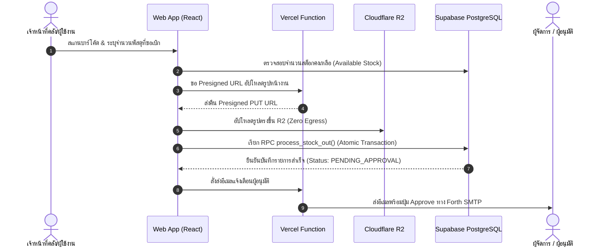

# 🏛️ System Architecture

เอกสารนี้อธิบายถึงภาพรวมสถาปัตยกรรมทางเทคนิคของระบบ **Stock-Flow** ซึ่งถูกออกแบบภายใต้หลักการ Modern Serverless & Decoupled Architecture เพื่อให้ได้ความเร็วสูงสุด ความเสถียร รองรับการขยายตัว และมีความปลอดภัยระดับองค์กร

---

## 1. ภาพรวมสถาปัตยกรรมระบบ (Architecture Overview)

ระบบ Stock-Flow ทำงานแบบ Single Page Application (SPA) / Progressive Web App (PWA) ติดต่อกับ Backend Services ผ่าน Secure HTTPS APIs และ Supabase RPCs:

```
+-------------------------------------------------------------------------+
|                       Client Layer (PWA / SPA)                          |
|  React 18 + Vite 5 + Tailwind CSS v4 + Lucide React + @react-pdf/renderer |
+-------------------------------------------------------------------------+
        │                                 │                       │
        │ 1. Auth / Data / RPCs           │ 2. Direct S3 Upload   │ 3. Serverless APIs
        ▼                                 ▼                       ▼
+-----------------------+     +-----------------------+     +-------------------+
|   Supabase Platform   |     |     Cloudflare R2     |     |   Vercel Functions|
| - Auth (JWT & RBAC)   |     | - S3-Compatible API   |     | - /api/send-email |
| - PostgreSQL Database |     | - Zero Egress Fees    |     | - /api/r2-upload  |
| - Row Level Security  |     | - High-Speed CDN Edge |     +-------------------+
| - Stored Proc (RPCs)  |     +-----------------------+               │
+-----------------------+                                             │ 4. SMTP Alert
                                                                      ▼
                                                            +-------------------+
                                                            | Forth Corp / M365 |
                                                            | Enterprise SMTP   |
                                                            +-------------------+
```

---

## 2. องค์ประกอบทางเทคนิคหลัก (Core Tech Stack)

| เลเยอร์ | เทคโนโลยี / เครื่องมือ | รายละเอียดหน้าที่ |
| :--- | :--- | :--- |
| **Frontend Framework** | **React 18.2** | คอมโพเนนต์ UI เชิงตอบสนองสูง มี State Management ที่รวดเร็ว |
| **Build & Dev Tool** | **Vite 5** | Bundler ประสิทธิภาพสูง พร้อม Fast Refresh (HMR) |
| **Styling Engine** | **Tailwind CSS v4** | CSS-first configuration พร้อม Utility classes แบบทันสมัย |
| **Iconography** | **Lucide React** | Clean, scalable inline SVG icons ตามมาตรฐาน UI Policy |
| **Document Generator** | **@react-pdf/renderer** | สร้างและ Export เอกสารใบเบิก/รายงานพัสดุ PDF ฝั่ง Client โดยตรง |
| **Spreadsheet Engine** | **SheetJS (xlsx 0.20.3)** | ตรวจสอบและ Import/Export ฐานข้อมูลพัสดุผ่านไฟล์ Excel/CSV |
| **Database & Auth** | **Supabase (PostgreSQL 15)** | ระบบจัดการฐานข้อมูลหลัก, การควบคุมสิทธิ์ (RLS), และ Stored Procedures |
| **Object Storage** | **Cloudflare R2** | จัดเก็บภาพถ่ายพัสดุและหลักฐานการเบิกจ่าย ค่า Egress 0 บาท |
| **Serverless API** | **Vercel Functions** | Edge runtime สำหรับ API หลังบ้านที่ต้องการ Secret Key |
| **Email Delivery** | **Nodemailer 6.10** | จัดส่งอีเมลแจ้งเตือนการอนุมัติผ่าน Enterprise SMTP |

---

## 3. รายละเอียดการทำงานของแต่ละส่วน (Subsystems)

### 3.1 Frontend & PWA Layer
- **Client Routing & Navigation:** รองรับทั้งโหมด POS หน้าคลัง (Fast Dispatch Terminal) และแดชบอร์ดฝ่ายพัสดุ
- **Barcode & QR Scanner:** รองรับกล้องมือถือ/แท็บเล็ตและเครื่องสแกนบาร์โค้ด USB/HID
- **Client-side PDF Generation:** สร้างเอกสาร PDF พิมพ์ลง A4/Receipt ได้ทันทีโดยไม่ต้องพึ่งพาเซิร์ฟเวอร์เรนเดอร์

### 3.2 Supabase PostgreSQL & Business Logic
- **Row-Level Security (RLS):** ข้อมูลทุกตารางถูกควบคุมด้วยสิทธิ์ตาม Role (`admin`, `staff`, `approver`, `user`)
- **Atomic Concurrency (RPC):** การตัดสต็อกและทำรายการใช้ Stored Procedure พร้อม `SELECT FOR UPDATE` เพื่อป้องกันสภาวะแข่งขัน (Race Condition)
- **Security Definer Functions:** มีการกำหนด `search_path = public` อย่างเข้มงวด ป้องกัน Search Path Hijacking

### 3.3 Cloudflare R2 Object Storage
- การอัปโหลดรูปภาพใช้กระบวนการ **Direct-to-R2 via Presigned URL**:
  1. Frontend ร้องขอ Presigned URL จาก `/api/r2-upload-url`
  2. Serverless Function ตรวจสอบสิทธิ์และสร้าง S3 `PutObjectCommand` Presigned URL (อายุ 15 นาที)
  3. Frontend ส่งไฟล์ภาพพัสดุขึ้น Cloudflare R2 โดยตรงผ่านคำสั่ง HTTP `PUT`
  4. ลดภาระการรับส่งข้อมูลของแอปพลิเคชันหลัก และประหยัดค่าใช้จ่าย Bandwidth อย่างสมบูรณ์

### 3.4 Vercel Serverless Functions
- **`/api/r2-upload-url`**: ให้บริการ S3 Presigned URL โดยเก็บบัญชี `R2_ACCESS_KEY_ID` และ `R2_SECRET_ACCESS_KEY` ไว้ในเซิร์ฟเวอร์อย่างปลอดภัย
- **`/api/send-email`**: ให้บริการส่งอีเมลแจ้งเตือนผู้บริหารและผู้อนุมัติเมื่อมีการขอเบิกวัสดุไซต์งาน หรือรายการเบิกด่วน พร้อมระบบ Retry และ Fallback

---

## 4. แผนผังลำดับข้อมูลการทำธุรกรรม (Data Flow Diagram)



---

## 5. การอ้างอิงเอกสารที่เกี่ยวข้อง
* ดูรายละเอียดฟังก์ชันการทำงาน: [[Features|Features]]
* ดูโครงสร้างตารางฐานข้อมูล: [[Database-and-Storage|Database-and-Storage]]
* ดูกระบวนการความปลอดภัย: [[Security|Security]]
