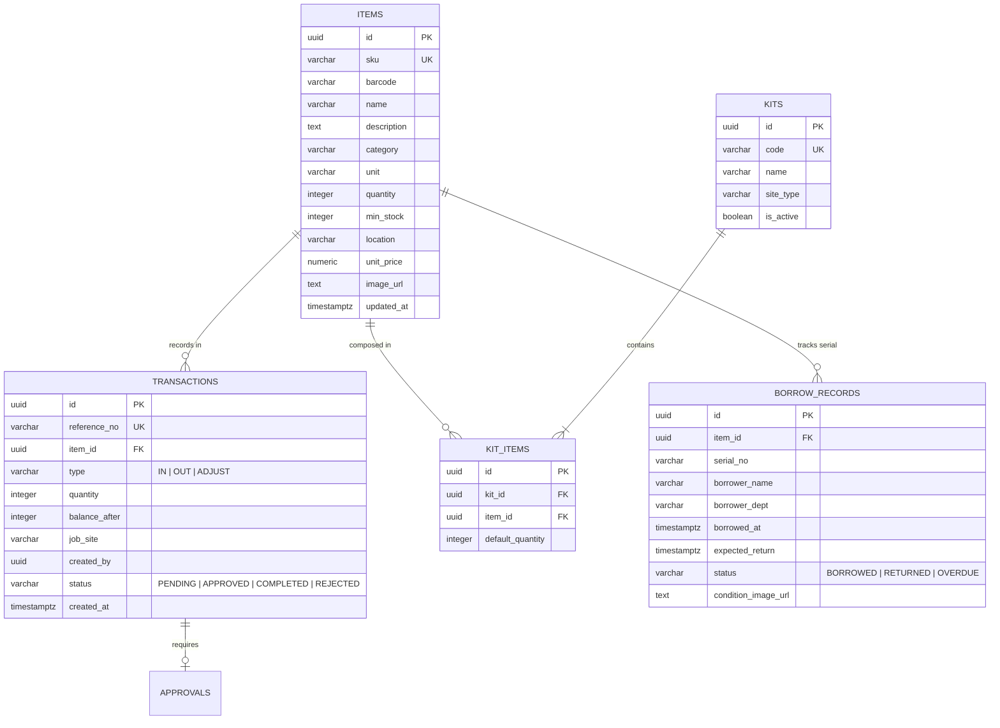

# 🗄️ Database Schema & Object Storage

เอกสารนี้ระบุโครงสร้างฐานข้อมูล **Supabase PostgreSQL** กลไกความปลอดภัย **Row-Level Security (RLS)** การจัดการธุรกรรมแบบอะตอมมิก (Atomic Concurrency) และการจัดเก็บไฟล์บน **Cloudflare R2**

---

## 1. โครงสร้างตารางหลัก (Core Database Tables)



---

## 2. การควบคุมความปลอดภัยระดับแถว (Row-Level Security: RLS)

ทุกตารางในฐานข้อมูลเปิดใช้งาน RLS อย่างเคร่งครัด (`ALTER TABLE <table_name> ENABLE ROW LEVEL SECURITY;`):

* **ตาราง `items`:**
  * ทุกคนที่ผ่านการยืนยันตัวตน (`authenticated`) สามารถอ่าน (`SELECT`) ได้
  * เฉพาะ Role `admin` และ `staff` เท่านั้นที่สามารถเพิ่ม แก้ไข หรือลบ (`INSERT`, `UPDATE`, `DELETE`)
* **ตาราง `transactions`:**
  * ผู้ใช้งานทั่วไปสามารถดูประวัติคำขอของตนเองได้
  * `admin` และ `manager` สามารถดูรายการทั้งหมดในองค์กรได้
* **ตาราง `approvals`:**
  * ผู้อนุมัติ (`manager` หรือ `admin`) เท่านั้นที่มีสิทธิ์ `UPDATE` สถานะการอนุมัติ

---

## 3. ธุรกรรมแบบอะตอมมิก & การป้องกัน Race Condition (RPCs)

เพื่อป้องกันปัญหาการเบิกสินค้าพร้อมกันจนสต็อกติดลบ การตัดสต็อกทั้งหมดดำเนินการผ่าน Stored Procedure ใน Supabase:

```sql
CREATE OR REPLACE FUNCTION process_stock_out(
    p_item_id UUID,
    p_quantity INT,
    p_job_site TEXT,
    p_user_id UUID
)
RETURNS JSONB
LANGUAGE plpgsql
SECURITY DEFINER
SET search_path = public
AS $$
DECLARE
    v_current_stock INT;
    v_new_stock INT;
    v_tx_id UUID;
BEGIN
    -- 1. ล็อกแถวข้อมูลเพื่อป้องกันธุรกรรมอื่นแทรก (Row-level locking)
    SELECT quantity INTO v_current_stock
    FROM items
    WHERE id = p_item_id
    FOR UPDATE;

    -- 2. ตรวจสอบสต็อกคงเหลือ
    IF v_current_stock < p_quantity THEN
        RAISE EXCEPTION 'สต็อกไม่เพียงพอ: คงเหลือ %, ต้องการ %', v_current_stock, p_quantity;
    END IF;

    -- 3. คำนวณยอดคงเหลือใหม่
    v_new_stock := v_current_stock - p_quantity;

    -- 4. บันทึกยอดสต็อกใหม่
    UPDATE items
    SET quantity = v_new_stock, updated_at = NOW()
    WHERE id = p_item_id;

    -- 5. บันทึก Transaction
    INSERT INTO transactions (item_id, type, quantity, balance_after, job_site, created_by)
    VALUES (p_item_id, 'OUT', p_quantity, v_new_stock, p_job_site, p_user_id)
    RETURNING id INTO v_tx_id;

    RETURN jsonb_build_object('success', true, 'transaction_id', v_tx_id, 'remaining_stock', v_new_stock);
END;
$$;
```

> [!IMPORTANT]
> สังเกตการใช้ `SECURITY DEFINER` คู่กับ `SET search_path = public` เสมอ เพื่อป้องกันช่องโหว่ Search Path Hijacking ตามมาตรฐาน PostgreSQL Security Best Practices

---

## 4. การจัดการพื้นที่จัดเก็บข้อมูล Cloudflare R2

ระบบใช้ **Cloudflare R2** สำหรับการจัดเก็บรูปภาพพัสดุและภาพหลักฐาน โดยใช้โปรโตคอล AWS S3 Compatible API:

### 4.1 โครงสร้างการจัดเก็บ Path ใน Bucket
* `items/{sku}/{hash}.jpg` — ภาพถ่ายประจำตัวสินค้า/พัสดุ
* `evidence/{year}/{month}/{tx_id}.jpg` — ภาพถ่ายสภาพเครื่องมือขณะส่งมอบหรือรับคืน
* `receipts/{tx_id}.pdf` — ใบเบิกจ่ายหรือสลิปพัสดุฉบับดิจิทัล

### 4.2 CORS Configuration บน Cloudflare R2 Bucket
ต้องตั้งค่า CORS บน Cloudflare Dashboard เพื่อให้ Frontend อัปโหลดไฟล์ได้โดยตรง:

```json
[
  {
    "AllowedOrigins": [
      "https://stockflowth.online",
      "https://eemeemmeex.github.io",
      "http://localhost:5173"
    ],
    "AllowedMethods": ["GET", "PUT", "HEAD"],
    "AllowedHeaders": ["*"],
    "ExposeHeaders": ["ETag"],
    "MaxAgeSeconds": 3600
  }
]
```

---

## 🧭 เอกสารที่เกี่ยวข้อง
* [[Architecture|Architecture]] — การเชื่อมต่อของเลเยอร์ต่างๆ
* [[Security|Security]] — สิทธิ์และการควบคุมผู้ใช้งาน
